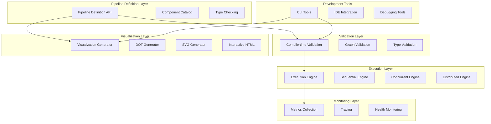

# Design Document

## Overview

The Go-Flow Advanced Pipeline System builds upon the existing Go-Flow foundation to create a comprehensive, production-ready library for building, visualizing, and executing complex data processing pipelines. The design leverages Go's type system for compile-time safety, provides automatic visualization generation, and includes a flexible execution engine architecture with comprehensive monitoring capabilities.

The system follows a component-based architecture where data processing pipelines are defined as directed acyclic graphs (DAGs) of interconnected components. Each component has well-defined input and output ports with explicit types, ensuring type safety across all connections through Go's generics system.

## Architecture

### High-Level Architecture



### Core Package Structure

The system is organized into focused packages that provide clear separation of concerns:

- **core/**: Core interfaces, types, and base implementations
- **components/**: Built-in component library with common data processing components
- **execution/**: Execution engines for different deployment scenarios
- **validation/**: Compile-time and runtime validation logic
- **visualization/**: Graph visualization and documentation generation
- **monitoring/**: Metrics collection, tracing, and observability
- **cli/**: Command-line tools for development and operations
- **testing/**: Testing utilities and framework integration

## Components and Interfaces

### Enhanced Component Interface

The component interface is enhanced to support advanced features while maintaining backward compatibility:

```go
type Component interface {
    // Core identification and configuration
    Name() string
    SetName(name string)
    
    // Port definitions with enhanced metadata
    InputPorts() []Port
    OutputPorts() []Port
    
    // Processing with context and error handling
    Process(ctx context.Context, inputs map[string]interface{}) (map[string]interface{}, error)
    
    // Validation and health checking
    Validate() error
    HealthCheck(ctx context.Context) error
    
    // Lifecycle management
    Initialize(ctx context.Context) error
    Cleanup(ctx context.Context) error
    
    // Metadata for documentation and tooling
    Description() string
    Version() string
    Tags() []string
}
```

### Enhanced Port Interface

Ports are enhanced to support rich metadata and schema validation:

```go
type Port interface {
    // Basic port information
    Name() string
    Type() reflect.Type
    Required() bool
    Description() string
    
    // Enhanced metadata
    Schema() Schema
    DefaultValue() interface{}
    Constraints() []Constraint
    
    // Documentation and examples
    Examples() []interface{}
    Documentation() string
}
```

### Schema System

A comprehensive schema system provides data validation and evolution support:

```go
type Schema interface {
    Validate(data interface{}) error
    Compatible(other Schema) bool
    Migrate(data interface{}, targetSchema Schema) (interface{}, error)
    JSONSchema() string
}

type Constraint interface {
    Validate(data interface{}) error
    Description() string
}
```

### Pipeline Composition

Pipelines can be composed hierarchically, allowing for modular design:

```go
type PipelineTemplate interface {
    Component
    Instantiate(params map[string]interface{}) (*Pipeline, error)
    Parameters() []Parameter
}

type Parameter struct {
    Name        string
    Type        reflect.Type
    Required    bool
    Default     interface{}
    Description string
}
```

## Data Models

### Pipeline Graph Model

The pipeline is represented as a directed graph with enhanced metadata:

```go
type Pipeline struct {
    // Core identification
    name        string
    version     string
    description string
    
    // Graph structure
    components  map[string]Component
    connections []Connection
    
    // Configuration and state
    config      PipelineConfig
    metadata    map[string]interface{}
    
    // Execution context
    engine      ExecutionEngine
    context     PipelineContext
    
    // Error tracking
    errors      []ValidationError
}

type Connection struct {
    FromComponent string
    FromPort      string
    ToComponent   string
    ToPort        string
    
    // Connection metadata
    Transform     DataTransform
    BufferSize    int
    Backpressure  BackpressureConfig
}

type PipelineConfig struct {
    // Execution configuration
    MaxConcurrency    int
    Timeout          time.Duration
    RetryPolicy      RetryPolicy
    
    // Resource limits
    MemoryLimit      int64
    CPULimit         float64
    
    // Monitoring configuration
    MetricsEnabled   bool
    TracingEnabled   bool
    LogLevel         string
}
```

### Component Registry

A centralized registry manages component discovery and instantiation:

```go
type ComponentRegistry interface {
    Register(name string, factory ComponentFactory) error
    Create(name string, config map[string]interface{}) (Component, error)
    List() []ComponentInfo
    GetInfo(name string) (ComponentInfo, error)
}

type ComponentFactory func(config map[string]interface{}) (Component, error)

type ComponentInfo struct {
    Name         string
    Version      string
    Description  string
    Category     string
    InputPorts   []PortInfo
    OutputPorts  []PortInfo
    Parameters   []ParameterInfo
    Examples     []ComponentExample
}
```

## Error Handling

### Comprehensive Error System

A structured error system provides detailed error information and recovery strategies:

```go
type PipelineError interface {
    error
    Component() string
    ErrorType() ErrorType
    Severity() Severity
    Recoverable() bool
    Context() map[string]interface{}
}

type ErrorType int
const (
    ValidationError ErrorType = iota
    RuntimeError
    ConfigurationError
    ResourceError
    NetworkError
)

type Severity int
const (
    Info Severity = iota
    Warning
    Error
    Critical
)

type ErrorHandler interface {
    HandleError(ctx context.Context, err PipelineError) ErrorAction
    CanRecover(err PipelineError) bool
}

type ErrorAction int
const (
    Continue ErrorAction = iota
    Retry
    Skip
    Abort
)
```

### Circuit Breaker Pattern

Components can implement circuit breaker patterns for resilience:

```go
type CircuitBreaker interface {
    Execute(ctx context.Context, fn func() (interface{}, error)) (interface{}, error)
    State() CircuitState
    Reset()
}

type CircuitState int
const (
    Closed CircuitState = iota
    Open
    HalfOpen
)
```

## Testing Strategy

### Component Testing Framework

A comprehensive testing framework supports unit and integration testing:

```go
type ComponentTester struct {
    component Component
    mocks     map[string]MockPort
    fixtures  map[string]interface{}
}

func NewComponentTester(c Component) *ComponentTester
func (t *ComponentTester) WithInput(port string, data interface{}) *ComponentTester
func (t *ComponentTester) WithMock(port string, mock MockPort) *ComponentTester
func (t *ComponentTester) ExpectOutput(port string, data interface{}) *ComponentTester
func (t *ComponentTester) Run(t *testing.T) TestResult

type MockPort interface {
    Port
    SetData(data interface{})
    GetData() interface{}
    CallCount() int
}
```

### Pipeline Testing

Pipeline-level testing supports end-to-end validation:

```go
type PipelineTest struct {
    pipeline    *Pipeline
    inputs      map[string]interface{}
    outputs     map[string]interface{}
    assertions  []Assertion
}

type Assertion interface {
    Assert(result PipelineResult) error
    Description() string
}

func TestPipeline(p *Pipeline) *PipelineTest
func (pt *PipelineTest) WithInput(name string, data interface{}) *PipelineTest
func (pt *PipelineTest) ExpectOutput(name string, data interface{}) *PipelineTest
func (pt *PipelineTest) WithAssertion(a Assertion) *PipelineTest
func (pt *PipelineTest) Run(ctx context.Context) (PipelineResult, error)
```

### Property-Based Testing

Support for property-based testing ensures robustness:

```go
type PropertyTest struct {
    component Component
    generator DataGenerator
    property  Property
}

type DataGenerator interface {
    Generate() interface{}
    Shrink(data interface{}) []interface{}
}

type Property interface {
    Check(input, output interface{}) bool
    Description() string
}
```

## Execution Engine Architecture

### Pluggable Engine System

The execution engine system supports multiple execution strategies:

```go
type ExecutionEngine interface {
    // Core execution
    Run(ctx context.Context, p *Pipeline, inputs, outputs map[string]chan interface{}) error
    
    // Lifecycle management
    Initialize(config EngineConfig) error
    Close() error
    
    // Monitoring and control
    Status() EngineStatus
    Metrics() EngineMetrics
    
    // Dynamic control
    Pause() error
    Resume() error
    Stop() error
}

type EngineConfig struct {
    MaxConcurrency   int
    BufferSize       int
    Timeout          time.Duration
    ResourceLimits   ResourceLimits
    MonitoringConfig MonitoringConfig
}

type EngineStatus struct {
    State           EngineState
    ComponentStates map[string]ComponentState
    Throughput      float64
    ErrorRate       float64
    Uptime          time.Duration
}
```

### Concurrent Execution Engine

Enhanced concurrent execution with intelligent scheduling:

```go
type ConcurrentEngine struct {
    scheduler    Scheduler
    workerPool   WorkerPool
    coordinator  ExecutionCoordinator
    monitor      ExecutionMonitor
}

type Scheduler interface {
    Schedule(ctx context.Context, tasks []Task) error
    Priority(task Task) int
    Dependencies(task Task) []Task
}

type WorkerPool interface {
    Submit(task Task) error
    Resize(size int) error
    Stats() WorkerStats
}
```

### Distributed Execution Engine

Support for distributed execution across multiple nodes:

```go
type DistributedEngine struct {
    coordinator  DistributedCoordinator
    nodeManager  NodeManager
    loadBalancer LoadBalancer
    consensus    ConsensusProtocol
}

type DistributedCoordinator interface {
    DistributePipeline(p *Pipeline) ([]NodeAssignment, error)
    MonitorExecution(ctx context.Context) error
    HandleNodeFailure(nodeID string) error
}

type NodeManager interface {
    RegisterNode(node Node) error
    GetAvailableNodes() []Node
    GetNodeCapacity(nodeID string) NodeCapacity
}
```

## Visualization System

### Multi-Format Visualization

The visualization system generates multiple output formats:

```go
type VisualizationEngine interface {
    Generate(p *Pipeline, format OutputFormat, options VisualizationOptions) ([]byte, error)
    SupportedFormats() []OutputFormat
    Validate(options VisualizationOptions) error
}

type OutputFormat int
const (
    DOT OutputFormat = iota
    SVG
    PNG
    HTML
    JSON
    YAML
)

type VisualizationOptions struct {
    Layout          LayoutAlgorithm
    Theme           Theme
    ShowTypes       bool
    ShowMetrics     bool
    HighlightPath   []string
    FilterComponents []string
    Annotations     map[string]string
}
```

### Interactive Visualization

HTML-based interactive visualizations provide rich exploration capabilities:

```go
type InteractiveVisualization struct {
    pipeline    *Pipeline
    layout      Layout
    interactions []Interaction
    widgets     []Widget
}

type Interaction interface {
    Type() InteractionType
    Handler() InteractionHandler
    Trigger() string
}

type Widget interface {
    Render() string
    Update(data interface{}) error
    EventHandlers() map[string]EventHandler
}
```

### Layout Algorithms

Multiple layout algorithms optimize visual representation:

```go
type LayoutAlgorithm interface {
    Layout(graph Graph) Layout
    Name() string
    Parameters() []LayoutParameter
}

type Layout struct {
    Nodes map[string]NodePosition
    Edges []EdgePath
    Bounds Rectangle
}

// Implementations: Hierarchical, Force-directed, Circular, Grid
```

## Monitoring and Observability

### Comprehensive Metrics System

Enhanced metrics collection with detailed component and pipeline metrics:

```go
type MetricsCollector interface {
    // Component metrics
    RecordComponentLatency(component string, duration time.Duration)
    RecordComponentThroughput(component string, count int64)
    RecordComponentError(component string, errorType string)
    
    // Pipeline metrics
    RecordPipelineLatency(pipeline string, duration time.Duration)
    RecordPipelineThroughput(pipeline string, count int64)
    RecordPipelineStatus(pipeline string, status PipelineStatus)
    
    // Resource metrics
    RecordMemoryUsage(component string, bytes int64)
    RecordCPUUsage(component string, percentage float64)
    
    // Custom metrics
    RecordCustomMetric(name string, value float64, labels map[string]string)
}

type MetricsExporter interface {
    Export(ctx context.Context, metrics []Metric) error
    SupportedFormats() []MetricsFormat
}
```

### Distributed Tracing

Integration with distributed tracing systems:

```go
type TracingProvider interface {
    StartSpan(ctx context.Context, name string, options SpanOptions) (context.Context, Span)
    InjectHeaders(ctx context.Context, headers map[string]string) error
    ExtractHeaders(headers map[string]string) (context.Context, error)
}

type Span interface {
    SetAttribute(key string, value interface{})
    SetStatus(status SpanStatus, message string)
    AddEvent(name string, attributes map[string]interface{})
    End()
}
```

### Health Monitoring

Comprehensive health monitoring and alerting:

```go
type HealthMonitor interface {
    CheckHealth(ctx context.Context) HealthStatus
    RegisterHealthCheck(name string, check HealthCheck) error
    GetHealthHistory(duration time.Duration) []HealthSnapshot
}

type HealthCheck interface {
    Check(ctx context.Context) HealthResult
    Name() string
    Timeout() time.Duration
}

type HealthStatus struct {
    Overall    HealthState
    Components map[string]HealthResult
    Timestamp  time.Time
}
```

## Development Tools

### CLI Tool Architecture

Comprehensive command-line tools for development and operations:

```go
type CLICommand interface {
    Name() string
    Description() string
    Flags() []Flag
    Execute(ctx context.Context, args []string) error
}

// Commands: validate, visualize, run, test, deploy, monitor
```

### IDE Integration

Language server protocol support for IDE integration:

```go
type LanguageServer interface {
    Initialize(params InitializeParams) error
    TextDocumentDidOpen(params DidOpenTextDocumentParams) error
    TextDocumentDidChange(params DidChangeTextDocumentParams) error
    TextDocumentCompletion(params CompletionParams) ([]CompletionItem, error)
    TextDocumentHover(params HoverParams) (*Hover, error)
    TextDocumentDefinition(params DefinitionParams) ([]Location, error)
}
```

### Debugging and Profiling

Advanced debugging and profiling capabilities:

```go
type Debugger interface {
    AttachToPipeline(p *Pipeline) error
    SetBreakpoint(component string, condition string) error
    Step() error
    Continue() error
    Inspect(component string) (ComponentState, error)
    GetCallStack() []StackFrame
}

type Profiler interface {
    StartProfiling(p *Pipeline) error
    StopProfiling() (ProfileResult, error)
    GetHotspots() []Hotspot
    GenerateReport(format ReportFormat) ([]byte, error)
}
```

This design provides a comprehensive foundation for the Go-Flow Advanced Pipeline System, addressing all requirements while maintaining extensibility and performance. The architecture supports both simple use cases and complex enterprise scenarios through its layered design and pluggable components.